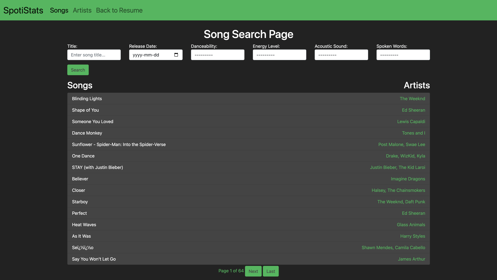

# Overview
Welcome to my resume portfolio project! This project is implemented in Django and aims to showcase my journey in the world of technology and software development. This project serves as a dynamic and interactive representation of my skills, achievements, and ongoing learning experiences. With multiple applications, each highlighting a different facet of my expertise, I aim to demonstrate how I've evolved and what I can bring to the table.

## Resume Page
The main page offers a overview of my professional journey, highlighting my education, work experience, and individual projects.

## Personal Projects
The projects aim to interact with the user in different ways. A dynamic website hosted via pythonanywhere is in use since the projects either make use of serverside calculations and/or reading from database. 

### MNIST Prediction
This project is a basic machine learning model, trained using the MNIST dataset, to accurately predict handwritten numbers from the user between 0 to 9. I also created some synthetic data by slightly rotating the images to improve the model. The front-end design is made to mimic a university chalkboard.

### Spotistats
This project leverages the 'Most Streamed Spotify Songs 2023' dataset from Kaggle, which has been structured into MySQL database tables to facilitate querying through Django filters.

